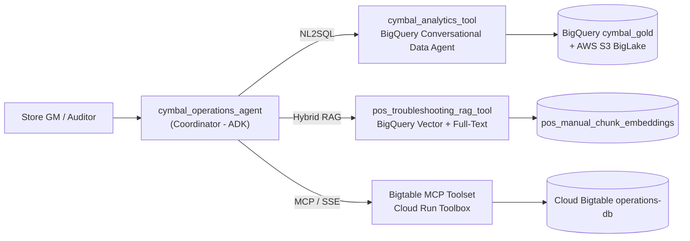

# Cymbal Retail Operations & Analytics Coordinator Agent

A production-hardened **ADK hub-and-spoke coordinator agent** that unifies three
decoupled analytical gateways behind one conversational interface for Store
General Managers, Operations Leads, and Loss-Prevention Auditors.



---

## Repository Layout

| Path | Purpose |
| :--- | :--- |
| `app/agent.py` | Root coordinator: system instruction, intent routing, tool binding. |
| `app/config.py` | **Single source of truth** for every environment-specific property. |
| `app/contracts.py` | Canonical user-facing response strings (decline + sanitized fallbacks). |
| `app/tools/analytics_tool.py` | BigQuery Conversational Data Agent gateway (NL2SQL). |
| `app/tools/rag_tool.py` | Vector + full-text hybrid RAG with SQL-side error-code boosting. |
| `app/tools/bigtable_tool.py` | MCP toolset factory for the Cloud Run Bigtable microservice. |
| `tools.yaml` | MCP Toolbox manifest (templated — no tenant identifiers committed). |
| `tests/unit/` | Offline pytest suite (portability, contract, logic, wiring gates). |
| `tests/eval/` | ADK evaluation datasets, metric config, and evaluation report. |
| `deploy/terraform/` | Infrastructure-as-Code: APIs, IAM, Secret Manager, Cloud Run. |
| `Makefile` / `Dockerfile` | Reproducible setup, quality gates, container, and deployment. |

---

## Quickstart

```bash
# 1. Configure your own environment (nothing is hardcoded in this repo)
cp .env.example app/.env && $EDITOR app/.env

# 2. Install dependencies into a local virtualenv
make install

# 3. Provision infrastructure and the MCP microservice
make tf-apply
make mcp-deploy      # prints the Cloud Run URL -> set BIGTABLE_MCP_URL in app/.env

# 4. Verify quality gates, then run the playground
make check           # ruff lint + 33 offline unit tests
make run             # ADK web UI on http://localhost:8000
```

Run `make help` for the full target list.

---

## Configuration Contract

**No GCP project id, region, Cloud Run endpoint, or Data Agent id is hardcoded
anywhere in this repository.** Every value resolves through `app/config.py`
from process environment variables, and the agent *fails fast* with a
`ConfigurationError` rather than silently defaulting to a foreign tenant.
A CI gate (`tests/unit/test_no_hardcoded_environment.py`) blocks any
regression.

| Variable | Required | Default | Description |
| :--- | :---: | :--- | :--- |
| `PROJECT_ID` | ✅ | — | Target GCP project (also accepts `GOOGLE_CLOUD_PROJECT` / `GCP_PROJECT`, then ADC). |
| `BIGTABLE_MCP_URL` | ✅ | — | Cloud Run MCP Toolbox base URL. |
| `LOCATION` | | `global` | Conversational Data Agent API location. |
| `REGION` | | `us-central1` | Cloud Run / Agent Runtime region. |
| `MODEL_NAME` | | `gemini-3.6-flash` | Coordinator LLM. |
| `DATA_AGENT_ID` | | `cymbal-retail-analytics-agent` | BigQuery Data Agent id. |
| `BIGTABLE_INSTANCE` | | `operations-db` | Real-time telemetry instance. |
| `RAG_DATASET_ID` / `RAG_TABLE_ID` | | `cymbal_gold` / `pos_manual_chunk_embeddings` | Embedding store. |
| `RAG_SIMILARITY_THRESHOLD` | | `0.70` | Certified retrieval confidence gate. |
| `BQ_MAX_BYTES_BILLED` | | `1073741824` | Hard BigQuery cost ceiling (1 GiB). |
| `TOOL_MAX_RETRIES` | | `3` | Transient-fault retry budget. |

---

## Safety & Response Contracts

See [`docs/design_blueprint.md`](docs/design_blueprint.md) for the normative spec.

| Contract | Behaviour |
| :--- | :--- |
| **§2.2 Error-code boosting** | Exact fault-code matches receive a `+0.15` SQL-side score boost (`+0.05` for the code family) so a precise `ERR-PAY-4001` chunk outranks a merely semantically similar one. |
| **§2.3 Out-of-scope decline** | Below the certified gate with no full-text match, the tool returns `contracts.OUT_OF_SCOPE_RESPONSE` **verbatim** — no score echo, no query echo, no parametric guessing. |
| **§4.1 Portability** | Zero hardcoded environment literals; enforced by a CI gate. |
| **§4.3 Sanitized fallbacks** | Exceptions, HTTP bodies, hostnames, and tokens are logged server-side only. Callers receive a shielded operator-readable notice. |
| **Cost guardrail** | Every BigQuery job is submitted with `maximum_bytes_billed`. |

---

## Testing

```bash
make test    # 33 offline unit tests, no cloud credentials required
make eval    # ADK golden-dataset evaluation (requires a live project)
make lint    # ruff lint + format check
```

CI (`.github/workflows/ci.yaml`) additionally runs `terraform fmt/validate` and
a full container build on every pull request. Install the local guardrails with
`pre-commit install`.
