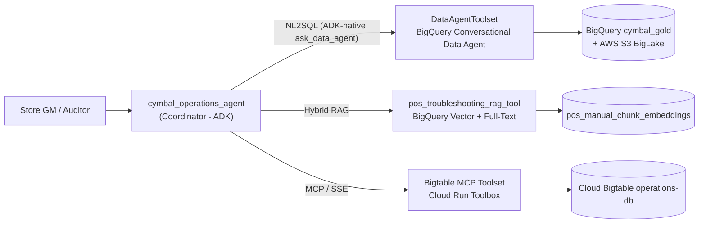

# Cymbal Retail Operations & Analytics Coordinator Agent

A production-hardened **ADK hub-and-spoke coordinator agent** that unifies three
decoupled analytical gateways behind one conversational interface for Store
General Managers, Operations Leads, and Loss-Prevention Auditors.



---

## Repository Layout

| Path | Purpose |
| :--- | :--- |
| `app/agent.py` | Root coordinator: system instruction, intent routing, tool binding. |
| `app/config.py` | **Single source of truth** for every environment-specific property. |
| `app/contracts.py` | Canonical user-facing response strings (decline + sanitized fallbacks). |
| `app/tools/analytics_tool.py` | Analytics gateway: ADK-native `DataAgentToolset` (`ask_data_agent`) + degraded REST adapter. |
| `app/tools/rag_tool.py` | Vector + full-text hybrid RAG with SQL-side error-code boosting. |
| `app/tools/bigtable_tool.py` | MCP toolset factory for the Cloud Run Bigtable microservice. |
| `tools.yaml` | MCP Toolbox manifest (templated — no tenant identifiers committed). |
| `tests/unit/` | Hermetic offline pytest suite (portability, contract, logic, wiring gates). |
| `tests/integration/` | Online contract tests against live GCP backends (opt-in via `RUN_INTEGRATION_TESTS=1`). |
| `app/fast_api_app.py` | Container entrypoint: ADK API routes + A2A + the Console Playground proxy. |
| `app/app_utils/` | Session/artifact services, A2A wiring, reasoning-engine adapter. |
| `tests/eval/` | Evaluation datasets, metric config, custom metrics, and the evaluation report. |
| `tests/eval/metrics/` | Deterministic zero-token guardrail metrics (`evaluate(instance)` contract). |
| `uv.lock` | Pinned dependency closure, resolved against **public PyPI** (see Deployment). |
| `deploy/terraform/` | Infrastructure-as-Code: APIs, IAM, Secret Manager, Cloud Run. |
| `Makefile` / `Dockerfile` | Reproducible setup, quality gates, container, and deployment. |

---

## Quickstart

```bash
# 1. Configure your own environment (nothing is hardcoded in this repo)
cp .env.example app/.env && $EDITOR app/.env

# 2. Install dependencies into a local virtualenv
make install

# 3. Provision infrastructure and the MCP microservice
make tf-apply
make mcp-deploy      # prints the Cloud Run URL -> set BIGTABLE_MCP_URL in app/.env

# 4. Verify quality gates, then run the playground
make check           # ruff lint + 35 hermetic unit tests
make run             # ADK web UI on http://localhost:8000
```

Run `make help` for the full target list.

---

## Configuration Contract

**No GCP project id, region, Cloud Run endpoint, or Data Agent id is hardcoded
anywhere in this repository.** Every value resolves through `app/config.py`
from process environment variables, and the agent *fails fast* with a
`ConfigurationError` rather than silently defaulting to a foreign tenant.
A CI gate (`tests/unit/test_no_hardcoded_environment.py`) blocks any
regression.

| Variable | Required | Default | Description |
| :--- | :---: | :--- | :--- |
| `PROJECT_ID` | ✅ | — | Target GCP project (also accepts `GOOGLE_CLOUD_PROJECT` / `GCP_PROJECT`, then ADC). |
| `BIGTABLE_MCP_URL` | ✅ | — | Cloud Run MCP Toolbox base URL. |
| `LOCATION` | | `global` | Conversational Data Agent API location. |
| `REGION` | | `us-central1` | Cloud Run / Agent Runtime region. |
| `MODEL_NAME` | | `gemini-3.6-flash` | Coordinator LLM. |
| `DATA_AGENT_ID` | | `cymbal-retail-analytics-agent` | BigQuery Data Agent id. |
| `BIGTABLE_INSTANCE` | | `operations-db` | Real-time telemetry instance. |
| `RAG_DATASET_ID` / `RAG_TABLE_ID` | | `cymbal_gold` / `pos_manual_chunk_embeddings` | Embedding store. |
| `RAG_SIMILARITY_THRESHOLD` | | `0.70` | Certified retrieval confidence gate. |
| `BQ_MAX_BYTES_BILLED` | | `1073741824` | Hard BigQuery cost ceiling (1 GiB). |
| `TOOL_MAX_RETRIES` | | `3` | Transient-fault retry budget. |

---

## Safety & Response Contracts

See [`docs/design_blueprint.md`](docs/design_blueprint.md) for the normative spec.

| Contract | Behaviour |
| :--- | :--- |
| **§2.2 Error-code boosting** | Exact fault-code matches receive a `+0.15` SQL-side score boost (`+0.05` for the code family) so a precise `ERR-PAY-4001` chunk outranks a merely semantically similar one. |
| **§2.3 Out-of-scope decline** | Below the certified gate with no full-text match, the tool returns `contracts.OUT_OF_SCOPE_RESPONSE` **verbatim**: `I cannot find certified warranty or repair rules for this specific error in our technical repository.` — no score echo, no query echo, no parametric guessing. |
| **§3.2 MCP tool naming** | The Toolbox publishes `read_cashier_realtime_alerts_sql` and `read_pos_transactions_enriched_sql`. Renaming either is a breaking contract change. |
| **§4.1 Portability** | Zero hardcoded environment literals; enforced by a CI gate. |
| **§4.3 Sanitized fallbacks** | Exceptions, HTTP bodies, hostnames, and tokens are logged server-side only. Callers receive a shielded operator-readable notice. |
| **Cost guardrail** | Every BigQuery job is submitted with `maximum_bytes_billed`. |

---

## Testing

Two deliberately separated layers:

| Layer | Command | Credentials | Runs in CI |
| :--- | :--- | :--- | :--- |
| Hermetic unit tests (61) | `make test` | none — sockets and ADC are mocked at import time | every push / PR |
| Online contract tests | `make test-integration` | ADC + a provisioned project | `workflow_dispatch` job via keyless WIF |

```bash
make test              # 61 hermetic unit tests, no cloud credentials required
make test-integration  # live BigQuery / Data Agent / MCP Toolbox contract tests
make eval              # ADK golden-dataset evaluation (requires a live project)
make lint              # ruff lint + format check
```

The integration layer is excluded from `testpaths` **and** additionally guarded
by `RUN_INTEGRATION_TESTS`, so a developer or fork without credentials never
sees a spurious red build. It asserts, read-only and cost-bounded: the RAG
corpus schema and row count, live grounded retrieval, the verbatim decline
contract, Data Agent resource reachability, and the MCP Toolbox tool manifest.

CI (`.github/workflows/ci.yaml`) additionally runs `terraform fmt/validate` and
a full container build on every pull request. Install the local guardrails with
`pre-commit install`.


---

## Observability — BigQuery Agent Analytics

`app/agent.py` exports an `App` carrying `BigQueryAgentAnalyticsPlugin`. ADK's
agent loader resolves `app` **before** `root_agent`, and that is what actually
activates the plugin chain — exporting only `root_agent` yields an agent that
runs perfectly and logs nothing.

Every prompt, LLM response, tool invocation (arguments + latency), token count
and error is streamed to `<project>.agent_telemetry.events` over the BigQuery
Storage Write API (gRPC), asynchronously, without blocking a turn. The plugin
also materializes the `v_*` analysis views (`v_llm_response`, `v_tool_completed`,
…) that the telemetry Data Agent and the dashboard notebook query.

| Setting | Env var | Default | Note |
| :--- | :--- | :--- | :--- |
| Dataset | `BQ_TELEMETRY_DATASET` | `agent_telemetry` | |
| Table | `BQ_TELEMETRY_TABLE` | `events` | **Overrides the plugin default `agent_events`.** |
| Location | `BQ_TELEMETRY_LOCATION` | `$REGION` | Must match the dataset's region. |
| Kill switch | `BQ_TELEMETRY_ENABLED` | `1` | |

**Failure posture:** observability must never take the agent down. If the plugin
cannot be constructed — missing optional dependency, no telemetry IAM —
`build_telemetry_plugins()` logs the cause server-side and returns `[]`. The
agent starts without telemetry rather than not at all.

Telemetry is also a debugging instrument, not just a dashboard feed. When a
system-instruction change appeared to have no effect (nine eval responses came
back byte-identical), querying `LLM_REQUEST` rows confirmed the new text *was*
in the prompt — which redirected the fix from "why isn't it loading" to "why
isn't the model complying".

```sql
SELECT FORMAT_TIMESTAMP('%H:%M:%S', timestamp) AS ts,
       REGEXP_CONTAINS(TO_JSON_STRING(t), 'RULE ZERO') AS has_rule_zero
FROM `<project>.agent_telemetry.events` t
WHERE event_type = 'LLM_REQUEST'
ORDER BY timestamp DESC LIMIT 10;
```

---

## Deployment — Vertex AI Agent Runtime

```bash
agents-cli deploy \
  --deployment-target agent_runtime \
  --project "$PROJECT_ID" --region us-central1 \
  --service-name cymbal_operations_agent \
  --service-account "cymbal-sa-data@$PROJECT_ID.iam.gserviceaccount.com" \
  --update-env-vars "GOOGLE_GENAI_USE_VERTEXAI=TRUE,GOOGLE_CLOUD_PROJECT=$PROJECT_ID,..."
```

Four things this repository had to get right before the build would succeed:

1. **A `Dockerfile` is mandatory.** Agent Runtime uploads the source tree and
   builds it; `agents-cli deploy` refuses to start without one. The image runs
   `uvicorn app.fast_api_app:app` on 8080 as a non-root uid.
2. **The lockfile must resolve against public PyPI.** A Google workstation ships
   a machine-wide `~/.config/uv/uv.toml` whose default index is the internal
   Artifact Foundry mirror. Cloud Build cannot authenticate to it, so an
   inherited index fails the build with `401 Unauthorized`. `pyproject.toml`
   therefore pins `[[tool.uv.index]] url = "https://pypi.org/simple"` in-project.
   Regenerate with `uv lock` and verify:
   ```bash
   grep -o 'registry = "[^"]*"' uv.lock | sort -u   # must print only pypi.org/simple
   ```
3. **The dependency closure must be complete.** `uv sync --frozen` installs
   exactly what `pyproject.toml` declares. Two extras are easy to miss and both
   fail at container *start*, not build: `google-adk[mcp]` (without it the
   Bigtable gateway dies with `No module named 'mcp'`) and
   `google-adk[bigquery-analytics]` (without it telemetry silently disappears).
4. **Configuration must load before the package body runs.** `app/agent.py`
   builds its toolsets at module scope, so `app/__init__.py` calls
   `load_dotenv(Path(__file__).with_name(".env"))` as its first statement.
   `fast_api_app` also calls `load_dotenv()`, but that executes *after* the
   package `__init__` — too late, and the container would crash on boot with
   `ConfigurationError: BIGTABLE_MCP_URL is not configured`. Real environment
   variables always win, so `--update-env-vars` remains authoritative in cloud.

`app/.env` is gitignored and excluded from the source upload by `.gcloudignore`;
it is a local-development convenience only.
